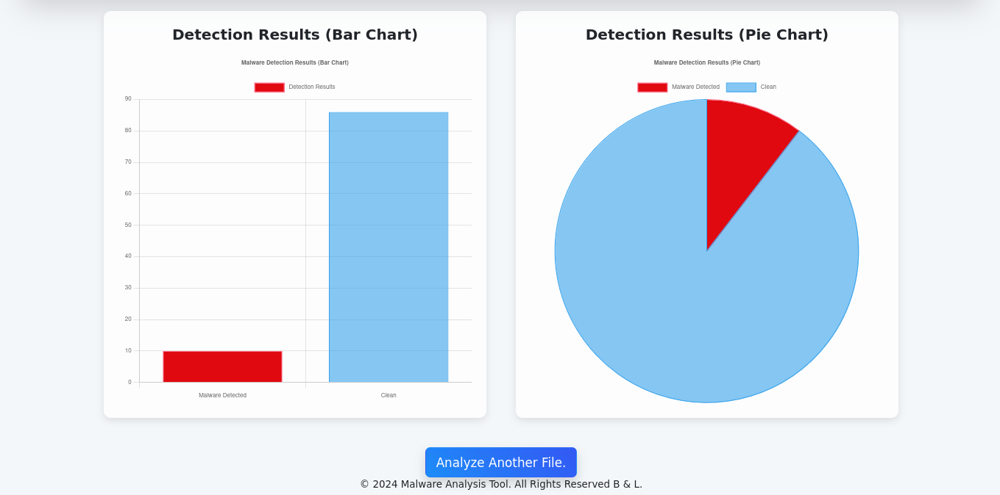

# Malware Detection and Analysis using Machine Learning

Malware Detection and Analysis using Machine Learning WebApp is a robust tool designed to provide users with an intuitive interface for analyzing and detecting malware in various file formats. This web app leverages both static analysis through the API and advanced machine learning techniques to ensure comprehensive threat assessment. MDAML is created to address the need for an accessible and user-friendly platform that enables efficient malware analysis for files, URLs, and executables.

### DEMO Static

Below is a quick walkthrough demonstrating the **Static Analysis using API** feature in action.

**Upload Page**  
  
*Description: A user selects a file from their local directory for analysis.*

**Result Page**  

*Description: Analysis results showing threat intelligence based on VirusTotal’s database.*

> **Video Demo**  
> For a more detailed demonstration, watch the video below:  
> 

---

### How It Works

1. **User Input**: The user uploads a file or provides a URL for analysis.
2. **VirusTotal API Integration**: The application sends the file or URL to VirusTotal's API to fetch any associated threat intelligence data.
3. **Result Display**: The retrieved information is processed and displayed on the results page, which includes:
    - **Scan Date**: Date of the last scan for the submitted file/URL.
    - **Detection Ratio**: Ratio of the VirusTotal engines that detected a threat.
    - **Detailed Results**: A breakdown of results from different scanning engines.

---

### Benefits of Static Analysis using API

- **Quick Detection**: Allows immediate scanning using a reliable external threat database.
- **Automated Insights**: Fetches relevant intelligence data without requiring manual lookup.
- **Comprehensive Detection**: Aggregates results from multiple sources to improve detection accuracy.

This tool integrates two key methods to detect potential threats, providing users with a comprehensive approach to assess security risks.

---

**Note**: The VirusTotal API has rate limits, so depending on usage, some requests may experience throttling or delayed responses. Refer to the [VirusTotal API documentation](https://developers.virustotal.com/) for more details on rate limits and usage policies.

---

## Machine Learning-Based Detection

The **Machine Learning-Based Detection** component leverages a machine learning model trained to detect malicious behavior in executable files. By focusing on feature extraction from Portable Executable (PE) headers, this tool offers an advanced, ML-powered approach to identify malware within `.exe` and `.dll` files.

---

### Technologies Used by ML

This module uses the following technologies:

- **Python**
- **Scikit-Learn**
- **Flask**
- **NumPy**
- **Pandas**
- **Matplotlib**
- **pefile**
- **Joblib**
---

---

### DEMO ML

Below is a visual walkthrough showing how the **Machine Learning-Based Detection** feature works.

**Upload Page**  
  
*Description: The user selects an executable file for analysis.*

**Analysis Results**  
  
*Description: Results of the ML-based detection showing whether the file is benign or malicious.*

> **Video Demo**  
> For a detailed walkthrough, watch the video below:  
> 

---

### How It Works

1. **File Upload**: The user uploads an executable file (.exe or .dll) for ML-based analysis.
2. **Feature Extraction**: The system extracts PE header features and selects only the most important features based on prior analysis.
3. **Model Prediction**: The Random Forest model uses the extracted features to predict if the file is benign or malicious.
4. **Result Display**: The application displays the result on a user-friendly interface, including probability scores and model confidence.
   
---

### Benefits of Machine Learning-Based Detection

- **High Precision**: The model achieves high accuracy in detecting malware, minimizing false positives.
- **Automated Feature Selection**: Uses the most relevant features for analysis, improving both speed and accuracy.
- **Focused Detection**: Designed specifically for executables, ensuring optimized and reliable detection for a key threat vector.

This ML-based approach complements the static analysis, providing a comprehensive toolkit for malware detection.

---

**Note**: The accuracy and precision of the model are validated on a balanced dataset, ensuring reliable performance on new and unseen data.

---

## 🔮 Future Work

- [ ] **Expand Machine Learning Capabilities**
    
- [ ] **Add Additional File Type Support**

- [ ] **Integrate Dynamic Analysis**
  - [ ] Implement sandboxed environments for real-time behavioral analysis of files.
  - [ ] Capture runtime system changes and network traffic to detect suspicious behaviors.

- [ ] **Enhance the User Interface**
  - [ ] Develop a dashboard for detailed analysis results, including threat history and patterns.
  - [ ] Provide visual insights like heatmaps, trend graphs, and risk scores.
